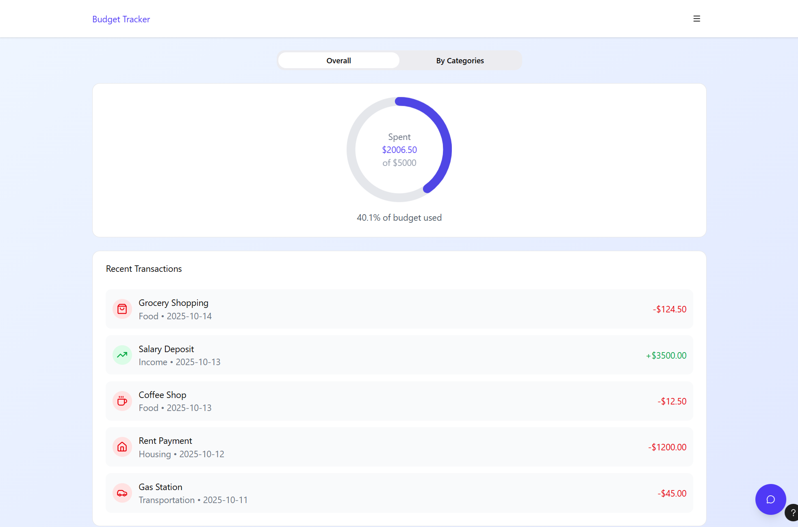
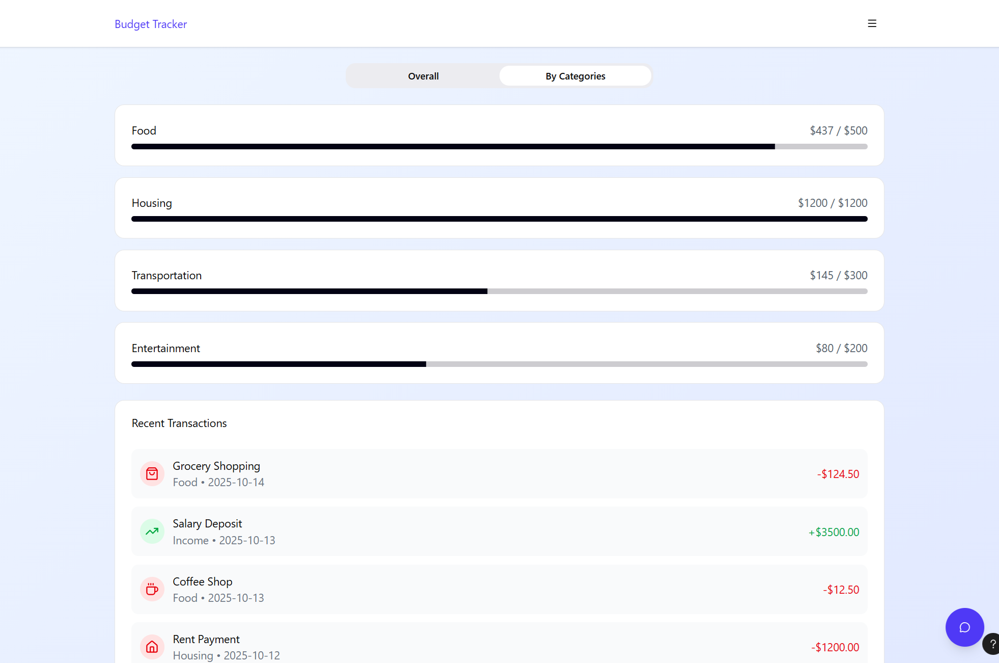

# Local Budget Assistant using SLM with RAG
A **local Small Language Model (SLM)–based AI agent** implemented with **Llama.rn** and **React Native**, designed for **on-device financial reasoning** on mobile.

The system **integrates Retrieval-Augmented Generation (RAG)** to enhance context understanding and accuracy while maintaining **full offline operation and data privacy**.

BudgetAssistant-RAG-Llama.rn

---

## FUTURE IMPROVE FOR CHATBOT
- Add data from 4 catagories to the promp and use it to give advice. 
- Print welcome message
- Bring embedding model to assert to save time

---

## EXTRA: 
- May parse response to update the catagories and pie chart??
- Add sugessions

---

## SAMPLE UX/UI FOR REFERENCE

   
  <i>Overall Screen</i>

   
  <i>Catagories Screen</i>

   
  <i>ChatBot Screen</i>

